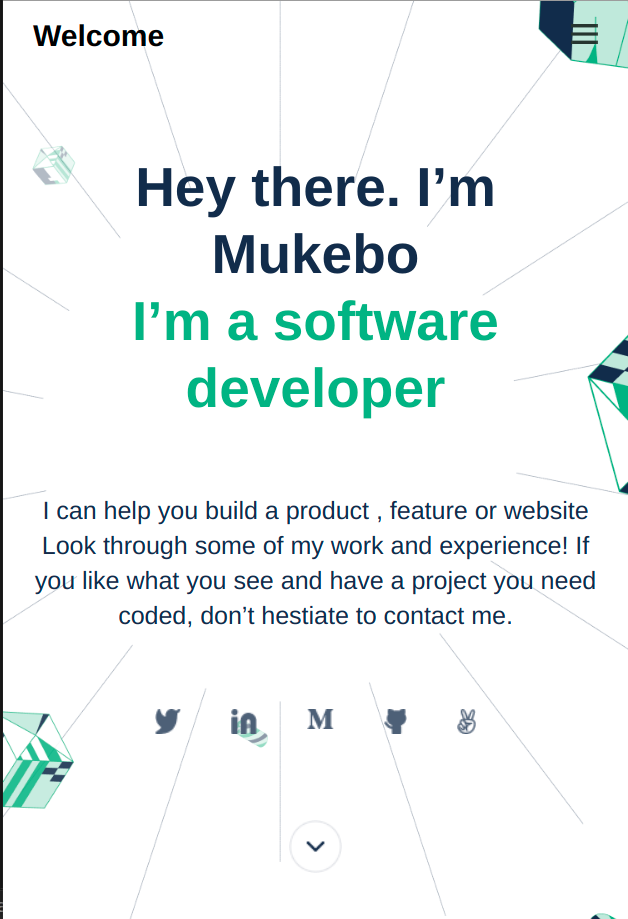
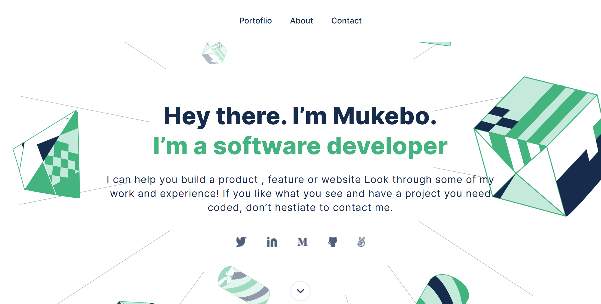

# Personal Portfolio

## Description 

>  Mobile version screenshot.

>  Desktop version screenshot.

> The main goal for this project is to: 

- Understand how to parse a Figma design to create a UI.
- Flexbox to place elements on the page.
- Use CSS Grid to place elements on the page.
- Use images and backgrounds to enhance the look of the website.
- Create forms with HTML5 validations.
- Understand how to create UIs adaptable to different screen sizes using Media Queries.
- Understand the usefulness of transitions and animations.
- Use GitHub Pages to deploy web pages.
- Add Google Analytics to a webpage and use it to track activity on that page.
- Changes regarding accessibility.
- Use basic JavaScript syntax.
- Use JavaScript to manipulate DOM elements.
- Use JavaScript events.
- Use objects to store and access data.
- Use client-side validation to catch and throw errors in the UI.
- Build a personal portfolio site.

## Built With

- HTML
- CSS
- CSS Flexbox
- CSS CSS Grid
- Git & GitHub

## Live Demo

[Live Demo Link](https://benmukebo.github.io/Personal_Portfolio/)

## Getting Started

To get a local copy for this project and running follow these simple example steps.

### Prerequisites

- You need to have git installed in your machine.
- A text editor or terminal
- A web browser to view output

### Setup

- To clone the repository run this command `git clone https://github.com/BenMukebo/Personal_Portfolio.git`

## Test

For tracking linter errors locally you need to follow these steps:

- After cloning the project you need to run this command
  > npm install
  > This command will download all the dependencies of the project

- For tracking the linter errors in HTML file run:
  > npx hint .

- And for tracking the linter errors in CSS file run:
  > npx stylelint "**/*.{css,scss}"

## Author

👤 **Kasongo Mukebo Ben**

- GitHub: [@BenMukebo](https://github.com/BenMukebo)
- Twitter: [@BenMukebo](https://twitter.com/BenMukebo)
- LinkedIn: [Kasongo Mukebo Ben](https://www.linkedin.com/in/kasongo-mukebo-ben-591720205/)

## 🤝 Contributing

Contributions, issues, and feature requests are welcome!

Feel free to check the [issues page](https://github.com/BenMukebo/Personal_Portfolio.git/issues/).

## Show your support

Give a ⭐️ if you like this project!

## Acknowledgments

- Hat tip to Figma for their templates
- Hat tip to [Microvers](www.microverse.org) curriculum and all the team 
- Thanks to Code Reviewers
- Thanks to My coding Partners 
- Thanks to My Morning-session-group Partners and
- Thanks to My standup-team Partners
  

## 📝 License

This project is MIT licensed.